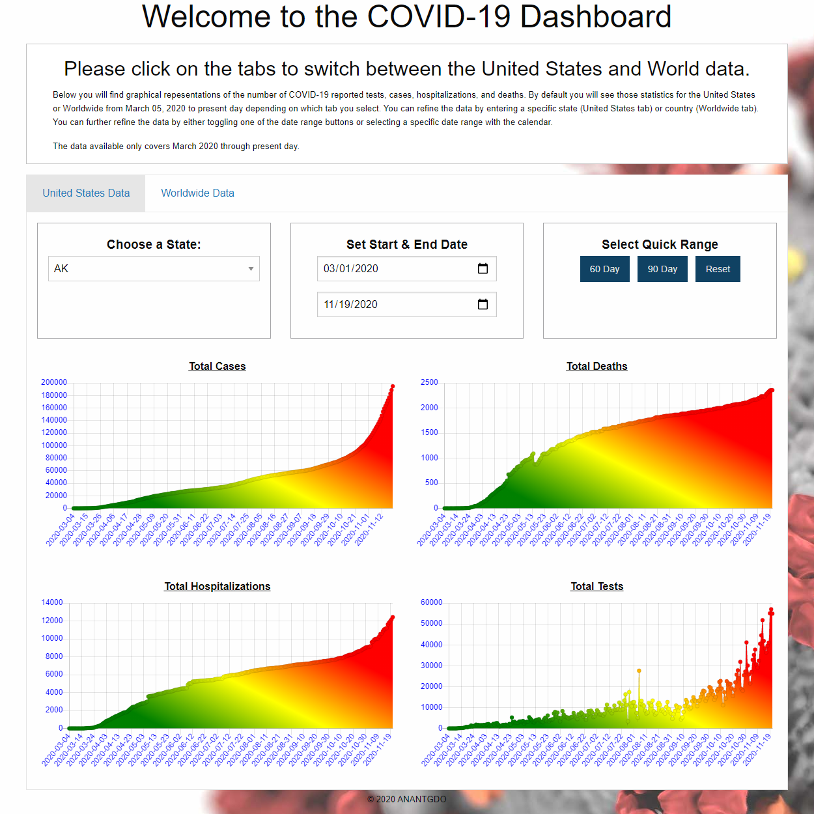
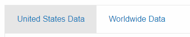
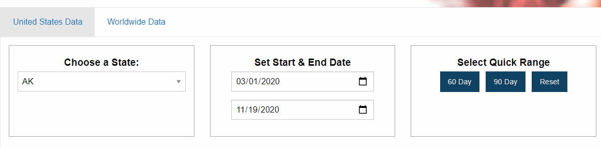
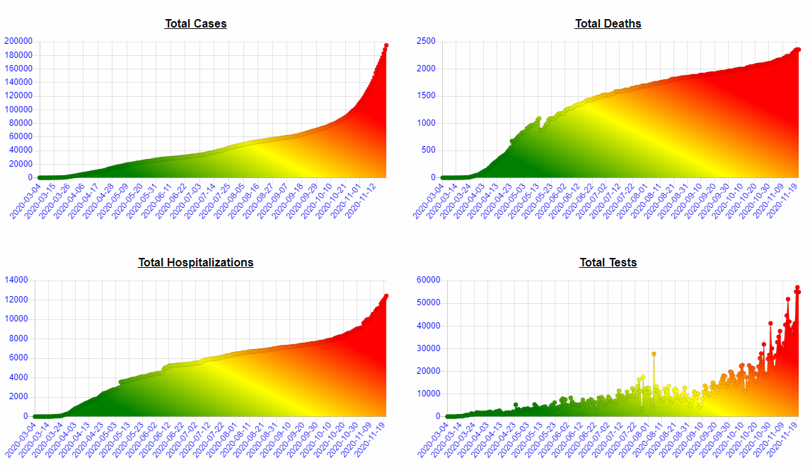
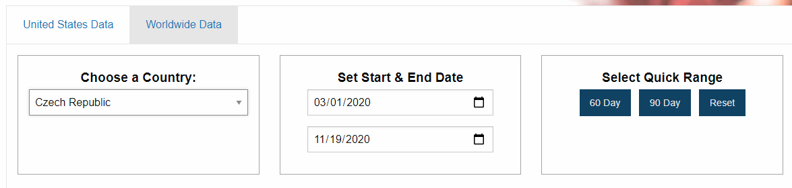
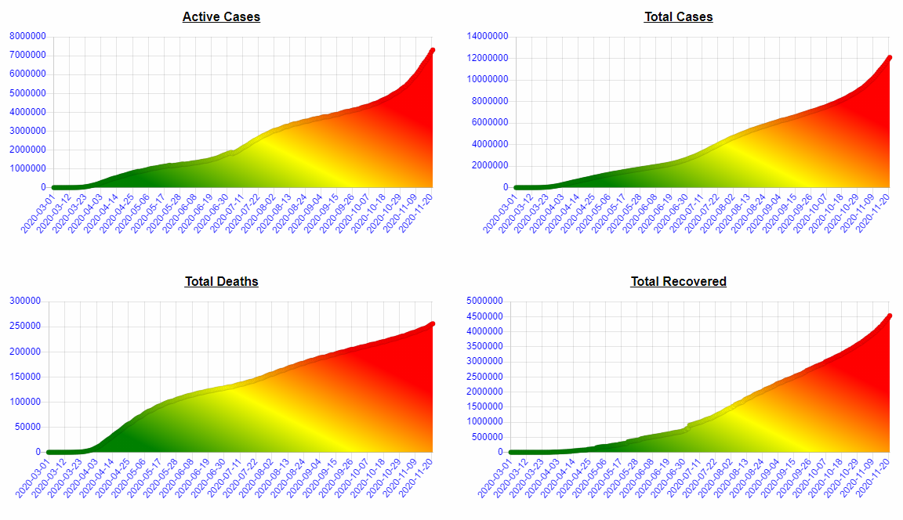

# COVID-19 Dashboard - Team 5 Project 1

Our project is to provide a dashboard that users can utilize to check COVID-19 data in the US.

Team consists of Allan Nandlal, Alexander Nieves, Theresa Grier, and Devon Owens.

## Links

The deployed app can be accessed at: [https://anandlal1080.github.io/covid19-dashboard/](https://anandlal1080.github.io/covid19-dashboard/)

## Main Page

## User Interaction

This page offers 2 options for covid-10 data. US States and Countries.

The user needs to select which data they would like to look at. United States Data or Worldwide Data

## United States Data

If the user selects United States Data, they would then have to select the State they are interested is looking at as well at the time ranges they want. There are a few buttons for convenience ranges such as 60 day and 90 day options.

Once these options are selected, the following graphs will plot.

These charts show Total Cases, Total Deaths, Total Hospitalizations and Total Tests.

## Worldwide Data

If the user selects Worldwide Data, they would then have to select the Country they are interested is looking at as well at the time ranges they want. There are a few buttons for convenience ranges such as 60 day and 90 day options.

Once these options are selected, the following graphs will plot.

These charts show Active Cases, Total Cases, Total Deaths and Total Recovered.
