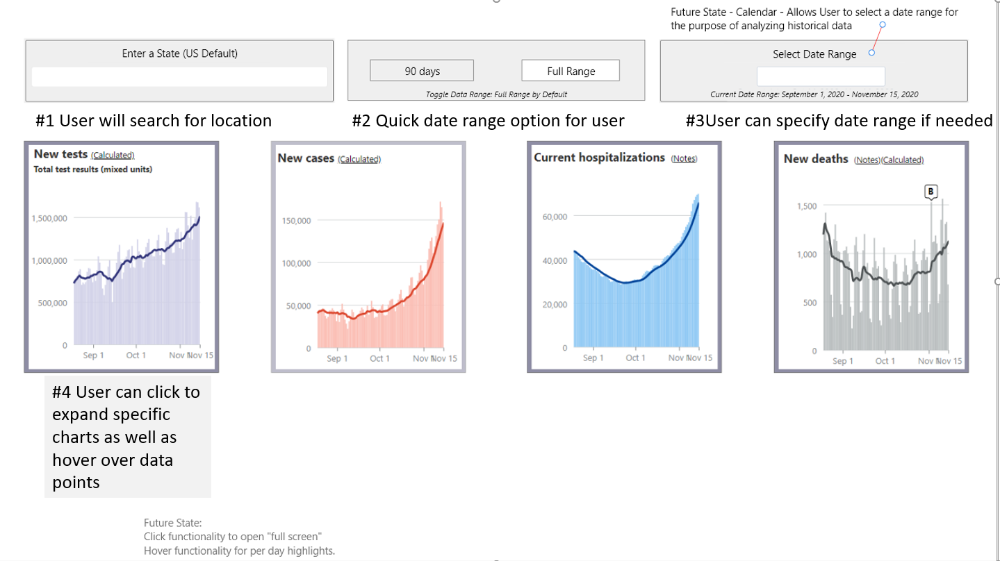

# COVID-19 Dashboard - Team 5 Project 1 #

Our project is to provide a dashboard that users can utilize to check COVID-19 data in the US.
Team consists of Allan Nandlal, Alexander Nieves, Theresa Grier, and Devon Owens.

## User Story ##
For this project, the User Story will be divided into two categories. Target Users and Issues.

Target users are who we want to go after to use this app. They are as follows:

* Business Travelers

* Tourists

* IG travel Influencers

* High Risk Groups

* Healthcare Workers

## User Issues ##
The User Issues are really what would be the driving factor to get them to want to use our app. They are as follows:

* Determine risk for contracting based on location.

* Trends at locations – so that the user can make informed decisions about traveling to that location.

* Travel Restrictions - so that the user will know if they can travel to that location.

* Quarantine Requirements - so that the user will know if there are any specific quarantine requirements for that location.

* Restrictions - so that the user can know if they have to follow any specific instructions when they are at the location.

## User Interaction ##

Here we would like to user to do everything on the front end. The options presented would be as follows:

* Select Date Range for the data they was nt tolook at.

* Select Location: Country, City or State.

* Interact with the graphs that are presented.

## Wireframe ##

## Flow ##

## Links ##
The deployed app can be accessed at: [https://anandlal1080.github.io/covid19-dashboard/](https://anandlal1080.github.io/covid19-dashboard/)
